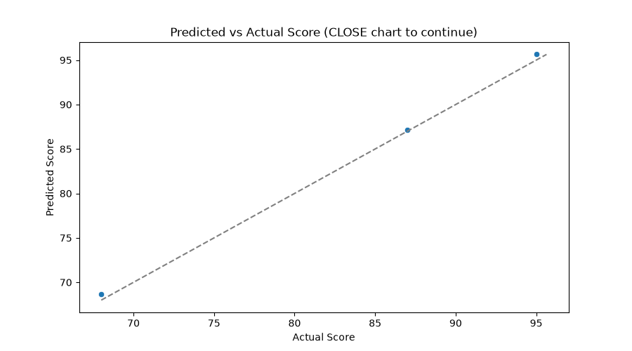

# ml-06-serving

[](https://denisecase.github.io/pro-analytics-02/workflow-b-apply-example-project/)
[](./pyproject.toml)
[](./LICENSE)

> Professional Python project: deploying and serving machine learning models.

## Publishing Predictive Engines

A machine learning model learns patterns from data.
But, once trained, the model might just sit on a single computer.

**Serving** a model means wrapping it in a small web service
so anyone can send it a data request over the internet
and get a prediction back.

In this project, we train a model that
identifies penguin species from physical measurements,
then deploy it so you can ask it
**what is the most likely penguin species**
(given the measurements you provided in the request)
from anywhere in the world.

## Project Description

This project focuses on learning to deploy a trained model so others can use it.

We learn to:

- save and load a trained model
- wrap a model in a simple API or script
- validate inputs and handle errors gracefully
- think about drift, versioning, and monitoring

## Project Dependencies

This project needs additional dependencies

```toml
    "fastapi[standard]", # for serving - a web framework for building APIs
    "uvicorn",           # for serving - ASGI server for FastAPI
    "joblib",            # for model serialization (saving and loading models)
```

## Project Process

A `.joblib` file is a serialized Python object that holds
the trained model frozen to disk.

The package `joblib` converts the in-memory **RandomForestClassifier**
(with all its learned decision trees and their weights)
into bytes and writes them to a file.

Loading it back gives us the same trained model
without having to retrain.

This is how serving a trained model works:
train once, save once, load once at startup,
then predict on every incoming request.

## Example Notebook + Your Notebook

Keep the example notebook as it is.
Either copy it or use it to build a new notebook that ends in \_yourname.
See [docs/your-files.md](docs/your-files.md) for more.

Links:

- [ml_06_case.ipynb](notebooks/ml_06_case.ipynb)
- [ml_06_teja.ipynb](notebooks/ml_06_teja.ipynb) - my custom Phase 5 notebook (Titanic survival)

## Working Files

You'll work with these areas:

- **data/raw** - raw data for exploration (only if you add a dataset)
- **docs/** - project narrative and documentation
- **src/mlstudio/** - the app is an example; run only (no need to modify)
- **notebooks/** - interactive analysis
- **pyproject.toml** - update authorship & links
- **zensical.toml** - update authorship & links

## My Files (Phase 4)

I copied the example module and made one small technical change to my copy.
The example files are unchanged and still run.

| Example (unchanged)       | My copy                   |
| -------------------------- | -------------------------- |
| `src/mlstudio/app_case.py` | `src/mlstudio/app_teja.py` |
| `tests/test_app_case.py`   | `tests/test_app_teja.py`   |

Run mine with:

```shell
uv run python -m mlstudio.app_teja
```

**What I changed:** the example only charts the raw data and the model
coefficients, so there was no way to see how close the model's predictions
land to the actual held-out scores. I added a third chart to `make_plots()`
that plots predicted score vs actual score for the test rows, with a diagonal
reference line, and saves it to `docs/images/pred_vs_actual_teja.png`.

**Why:** points on the diagonal are perfect predictions; points off the line
show over- or under-prediction at a glance. It turns the abstract MAE/R-squared
numbers into a picture I can read in one look.

**Bug I found and fixed along the way:** the first version of my chart plotted
`sns.scatterplot(x=y_test, y=y_pred)` directly against the pandas Series
returned by `train_test_split()`. That `y_test` keeps its original,
non-sequential row index while `model.predict()`'s output gets a fresh
`0, 1, 2` index, so seaborn silently aligned the two by index and dropped
every row whose index didn't happen to match - only 1 of the 3 test points
ever showed up. Converting `y_test` to a plain NumPy array before plotting
fixed it.

**Result:** on the 3 held-out test rows the model reports
`MAE 0.48` and `R-squared 1.00`, and the corrected chart shows all 3 points
sitting almost exactly on the diagonal line, confirming visually what the
near-perfect R-squared already said: on this small, clean, almost perfectly
linear 10-row dataset, the model's predictions barely miss the actual scores.



## My Files (Phase 5)

My custom project: a served model on a different dataset, target, and
feature set, including one feature (`sex`) the example never has to
deal with - a categorical column that must be encoded before it can be
used by the model, both at training time and at serving time.

| Example (unchanged)          | My copy                      |
| ------------------------------ | ------------------------------ |
| `src/mlstudio/model_builder_case.py` | `src/mlstudio/model_builder_teja.py` |
| `src/mlstudio/serve_case.py`         | `src/mlstudio/serve_teja.py`         |
| `tests/test_model_builder_case.py`   | `tests/test_model_builder_teja.py`   |
| `notebooks/ml_06_serve_model.ipynb`  | `notebooks/ml_06_teja.ipynb`         |
| `artifacts/model.joblib`             | `artifacts/model_teja.joblib`        |

Run mine with:

```shell
uv run python -m mlstudio.model_builder_teja
uv run fastapi dev src/mlstudio/serve_teja.py
```

**Dataset:** Seaborn `titanic` (891 passenger records).
**Target:** `survived` (0 = did not survive, 1 = survived) - binary classification,
in place of the example's 3-class penguin species.
**Features:** `pclass`, `sex`, `age`, `sibsp`, `parch`, `fare`.

**What I changed from the example:**

- A different dataset, target, and feature set (Titanic survival vs.
  penguin species).
- `sex` arrives as the strings `"male"`/`"female"`, so `model_builder_teja.py`
  encodes it to `0`/`1` before training, and `serve_teja.py` validates and
  re-applies that same encoding on every incoming request - rejecting any
  other value with a clean `ValueError` (HTTP 400) instead of crashing.
- Rows with missing `age` (177 of 891) are dropped, the same
  drop-missing-required-columns approach the example uses for penguins.
- The response includes a human-readable `survived: true/false` alongside
  the raw `0`/`1` prediction label.

**Why:** Titanic survival is a well-known binary classification problem with
a real categorical feature, so it exercises the parts of the serving
contract - input validation, encoding consistency between training and
serving - that the example's all-numeric penguin features never touch.

**How I verified it worked:** ran `uv run python -m mlstudio.model_builder_teja`
(trains, evaluates, and saves the artifact), `uv run python -m pytest`
(`test_model_builder_teja.py` passes, including an accuracy check),
`uv run python -m pyright` (0 errors), and exercised `serve_teja.predict_from_features()`
directly with a valid payload, a payload missing a feature, and a payload with
an invalid `sex` value - all three handled as expected. See
`notebooks/ml_06_teja.ipynb` for the full executed run.

**Result:** the RandomForestClassifier reaches **76.9% test accuracy**
predicting survival on the held-out 143 test rows (well above the ~59%
baseline of always predicting "did not survive"). A first-class passenger
who is a 29-year-old woman paying a $100 fare is predicted to survive;
missing features and unrecognized `sex` values are both rejected cleanly.

## Instructions (pro-analytics-02)

Follow the
[step-by-step workflow guide](https://denisecase.github.io/pro-analytics-02/workflow-b-apply-example-project/)
to complete:

1. Phase 1. **Start & Run**
2. Phase 2. **Change Authorship**
3. Phase 3. **Read & Understand**
4. Phase 4. **Modify**
5. Phase 5. **Apply**

## Challenges

Challenges are expected.
Sometimes instructions may not quite match your operating system.
When issues occur, share screenshots, error messages, and details about what you tried.
Working through issues is part of implementing professional projects.

## Success

After completing Phase 1. **Start & Run**, you'll have your own GitHub project,
with the example notebook executed and committed,
and running the example module will print out:

```shell
========================
Executed successfully!
========================
```

A new file `project.log` will appear in the root project folder.

## Command Reference

<details>
<summary>Show command reference</summary>

### In a machine terminal (open in your `Repos` folder)

After you get a copy of this repo in your own GitHub account,
open a machine terminal in your `Repos` folder:

```shell
# Replace username with YOUR GitHub username.
git clone https://github.com/vnallam09/ml-06-serving

cd ml-06-serving
code .
```

### In a VS Code terminal

These are listed for convenience.
For best results, follow the detailed instructions in
[pro-analytics-02 guide](https://denisecase.github.io/pro-analytics-02/).

```shell
uv self update
uv python pin 3.14
uv lock --upgrade
uv sync --extra dev --extra docs --upgrade

uvx pre-commit install
uvx pre-commit autoupdate

git add -A
uvx pre-commit run --all-files
# repeat if changes were made
uvx pre-commit run --all-files

# run the example module to verify the environment (.venv/)
uv run python -m mlstudio.app_case

# TASK 1: train the example model and save it to artifacts/model.joblib.
uv run python -m mlstudio.model_builder_case

# CUSTOM: After completing your custom project,
# Add the command to
# train your custom model and save it to artifacts/model_yourname.joblib
# uv run python -m mlstudio.model_builder_yourname

# run common chores
uv run ruff format .
uv run ruff check . --fix
uv run python -m pyright
uv run python -m pytest
uv run python -m zensical build

# save progress
git add -A
git commit -m "update"
git push -u origin main
```

</details>

## Notes

- Use the **UP ARROW** and **DOWN ARROW** in the terminal to scroll through past commands.
- Use `CTRL+f` to find (and replace) text within a file.
- You do not need to add to or modify `tests/`. They are provided for example only.
- Many files are silent helpers. Explore as you like, but nothing is required.
- You do NOT need to understand everything; understanding builds naturally over time.

## Troubleshooting >>>

If you see something like this in your terminal: `>>>` or `...`
You accidentally started Python interactive mode.
It happens.
Press `Ctrl+c` (both keys together) or `Ctrl+Z` then `Enter` on Windows.

## Example Output (Can Remove this Section after You Verify)

```shell
| INFO | MB | Load data.................
| INFO | MB | Loading dataset: penguins
| INFO | MB | Loaded: 344 rows, 7 columns
| INFO | MB | Model rows (after dropping missing): 342
| INFO | MB | Split data................
| INFO | MB | Train instances: 273
| INFO | MB | Test instances:  69
| INFO | MB | Train model...............
| INFO | MB | Training RandomForestClassifier on 273 instances
| INFO | MB | Training complete
| INFO | MB | Evaluate model............
| INFO | MB | Test accuracy: 1.000
| INFO | MB | Save model................
| INFO | MB | Saved model to: artifacts\model.joblib
| INFO | MB | Summarize.................
| INFO | MB | ========================
| INFO | MB | SUMMARY
| INFO | MB | ========================
| INFO | MB | Dataset:  penguins
| INFO | MB | Target:   species
| INFO | MB | Features: ['bill_length_mm', 'bill_depth_mm', 'flipper_length_mm', 'body_mass_g']
| INFO | MB | Artifact: artifacts\model.joblib
| INFO | MB | ========================
| INFO | MB | ========================
| INFO | MB | Executed successfully!
| INFO | MB | ========================
```

## Terminal 2: Right-click and Rename "server"

Open a second terminal. Right-click to rename this terminal "server".

Run:

```shell
# Task 2. Start the example server
uv run fastapi dev src/mlstudio/serve_case.py
```

Keep this terminal open.
You should see the following which
means it is ready to receive requests:

```text

   FastAPI   Starting development server 🚀

             Searching for package file structure from directories with __init__.py files
| INFO | M06 | === RUN START ===
| INFO | M06 | project=M06
| INFO | M06 | repo_dir=ml-06-serving
| INFO | M06 | python=3.14.0
| INFO | M06 | os=Windows 11
| INFO | M06 | shell=powershell
| INFO | M06 | cwd=.
| INFO | M06 | github_actions=False
| INFO | M06 | Loading model from: artifacts\model.joblib
| INFO | M06 | Model loaded successfully
             Importing from C:\Repos\ml\ml-06-serving\src

    module   📁 mlstudio
             ├── 🐍 __init__.py
             └── 🐍 serve_case.py

      code   Importing the FastAPI app object from the module with the following code:

             from mlstudio.serve_case import app

       app   Using import string: mlstudio.serve_case:app

    server   Server started at http://127.0.0.1:8000
    server   Documentation at http://127.0.0.1:8000/docs

       tip   Running in development mode, for production use: fastapi run

             Logs:

      INFO   Will watch for changes in these directories: ['C:\\Repos\\ml\\ml-06-serving']
      INFO   Uvicorn running on http://127.0.0.1:8000 (Press CTRL+C to quit)
      INFO   Started reloader process [31516] using WatchFiles
| INFO | M06 | === RUN START ===
| INFO | M06 | project=M06
| INFO | M06 | repo_dir=ml-06-serving
| INFO | M06 | python=3.14.0
| INFO | M06 | os=Windows 11
| INFO | M06 | shell=powershell
| INFO | M06 | cwd=.
| INFO | M06 | github_actions=False
| INFO | M06 | Loading model from: artifacts\model.joblib
| INFO | M06 | Model loaded successfully
      INFO   Started server process [10012]
      INFO   Waiting for application startup.
      INFO   Application startup complete.
```

## Terminal 3: Right-click and Rename "client"

Open a third terminal.
Right-click and rename it "client".

Use this terminal to **send a request** to the server.

We are making a request to the "/predict" endpoint.

Provide information about a penguin and ask
for the predicted species.

Line continuation characters for long commands are different by operating system.

- PowerShell uses a backtick.
- Bash and zsh use a back slash

The `curl` command means "check url".

- X defines the type of request
- H provides the requested response format (json data)
- d provides a json object (a penguin where we want to get the species)

### Windows PowerShell

```shell
# Task 3. Send a request to the server

curl -X POST http://127.0.0.1:8000/predict `
     -H "Content-Type: application/json" `
     -d '{"bill_length_mm": 39.1, "bill_depth_mm": 18.7, "flipper_length_mm": 181, "body_mass_g": 3750}'
```

### macOS / Linux

```shell
# Task 3. Send a request to the server

curl -X POST http://127.0.0.1:8000/predict \
     -H "Content-Type: application/json" \
     -d '{"bill_length_mm": 39.1, "bill_depth_mm": 18.7, "flipper_length_mm": 181, "body_mass_g": 3750}'
```

Should return the predicted result as JSON data:

```json
{ "prediction": "Adelie" }
```

Try sending some slightly different data - does it change the prediction?
Study the data.
Try to create a request that will answer with each of three different species (Adelie, Chinstrap, Gentoo)

## Try a Web-based ML Penguin Predictor on Render

Render hosts your ML model for free.
It is easy to set up, but they require a credit card (even for the free options).
The machines sleep so it can take a minute to wake up and answer.
See the docs/ for more.

Customize the request to see what species is predicted:

```shell
# PowerShell
curl -X POST https://ml-penguin-predictor.onrender.com/predict `
     -H "Content-Type: application/json" `
     -d '{"bill_length_mm": 39.1, "bill_depth_mm": 18.7, "flipper_length_mm": 181, "body_mass_g": 3750}'

# macOS / Linux
curl -X POST https://ml-penguin-predictor.onrender.com/predict \
     -H "Content-Type: application/json" \
     -d '{"bill_length_mm": 39.1, "bill_depth_mm": 18.7, "flipper_length_mm": 181, "body_mass_g": 3750}'
```

## Try a Web-based ML Penguin Predictor on HuggingFace

HuggingFace also hosts your ML model for free.
It is a bit harder to set up (they use their own repo and we upload files via the browser).
No credit card is required.
See the docs/ for more.

Customize the request to see what species is predicted:

```shell
# PowerShell
curl -X POST https://denisecase-ml-penguin-predictor.hf.space/predict `
     -H "Content-Type: application/json" `
     -d '{"bill_length_mm": 39.1, "bill_depth_mm": 18.7, "flipper_length_mm": 181, "body_mass_g": 3750}'

# macOS / Linux
curl -X POST https://denisecase-ml-penguin-predictor.hf.space/predict \
     -H "Content-Type: application/json" \
     -d '{"bill_length_mm": 39.1, "bill_depth_mm": 18.7, "flipper_length_mm": 181, "body_mass_g": 3750}'
```

## Findings and Visuals

Take screenshots of your charts and provide them here with a discussion.
In Markdown, display a figure by using:
an exclamation mark immediately followed by square brackets containing a useful caption
immediately followed by parentheses containing the relative path to your figure.
Note: When you start typing the path with a dot (.) for "here, in this directory",
the IDE may help complete the path.

In your custom project, follow this example, but

- your figures and narrative should reflect your work,
- this `README.md` should include your commands, process, and visuals, and
- `docs/index.md` should include your narrative.

Remove unnecessary instructional comments in your custom files.

Update figures to present interesting results from your custom project:


## Project Documentation

Additional project instructions, terms, and notes:

[docs/index.md](docs/index.md)

## Citation

[CITATION.cff](./CITATION.cff)

## License

[MIT](./LICENSE)
