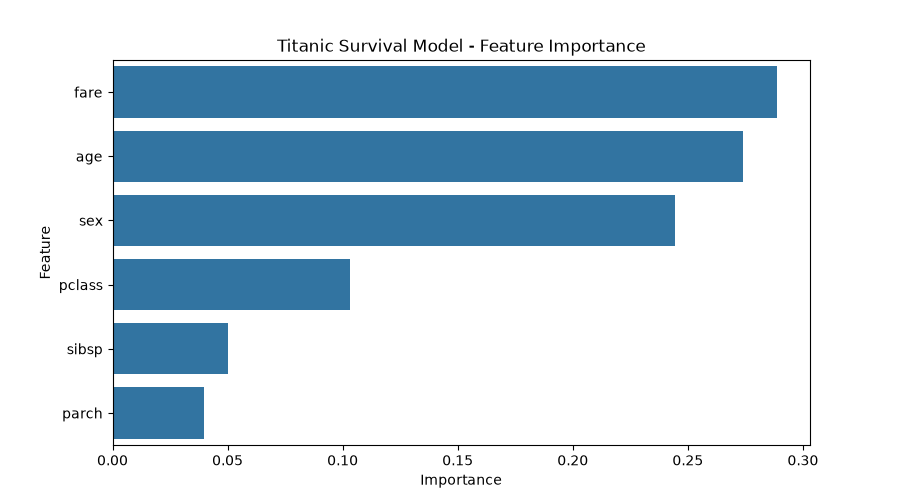

# Project Documentation

This site provides project documentation.
Use the documentation navigation to explore.

## How-To Guide

Many instructions are common to all our projects.

See
[⭐ **Workflow: Apply Example**](https://denisecase.github.io/pro-analytics-02/workflow-b-apply-example-project/)
to get the example projects running on your machine.

## Project Documentation Pages (docs/)

- **Home** - this documentation landing page
- [**Project Instructions**](./project-instructions.md)  - the standard project workflow
- [**Your Files**](./your-files.md) - how to copy the example and create your version
- [**Glossary**](./glossary.md) - project terms and concepts
- [**API**](./api.md) - autogenerated code documentation for the public project interface

## Serving a Model (Hosting an Endpoint)

- [**Online Predictions**](./api-predict.md)

## Deployment Options

- [**HuggingFace**](./huggingface.md) - free, no CC required
- [**Render**](./render.md) - free, easier, CC required

## Phase 4. Technical Modification

I copied `src/mlstudio/app_case.py` to `src/mlstudio/app_teja.py`
(with a matching `tests/test_app_teja.py`) and left the original example untouched.

- **What I changed:** the example's `make_plots()` only charts the raw data
  and the model coefficients. I added a third chart: predicted score vs
  actual score for the held-out test rows, with a diagonal reference line
  marking where a perfect prediction would land, saved to
  `docs/images/pred_vs_actual_teja.png`.
- **Why I chose that change:** the example already logs MAE and R-squared,
  but a single number doesn't show *where* a model over- or under-predicts.
  Plotting predicted vs actual makes that visible immediately.
- **How I verified it worked:** ran `uv run python -m pytest`
  (both `test_app_case.py` and `test_app_teja.py` pass), `uv run python -m pyright`
  (0 errors), and `uv run python -m mlstudio.app_teja`, confirming the script
  still logs `Executed successfully!` and produces three charts instead of two.
- **What result confirmed the change:** on the 3 held-out test rows the model
  reports `MAE 0.48` and `R-squared 1.00`; the new chart shows all 3 points
  sitting almost exactly on the diagonal line, which visually matches that
  near-perfect R-squared.

Compared with the example project, the workflow and every existing chart are
identical - the only difference is the added predicted-vs-actual chart in my
copy. The change itself was easy (it reuses the same `TEST_SIZE` and
`RANDOM_STATE` constants to reproduce the exact test split from
`train_model()`); the surprisingly challenging part was a bug I only found by
actually looking at the rendered chart: plotting the raw pandas Series
`x=y_test, y=y_pred` let seaborn align the two by index instead of by row
position, and since `y_test` keeps the original non-sequential split index
while `y_pred` gets a fresh `0, 1, 2` index, 2 of the 3 test points silently
vanished from the plot. Converting `y_test` to a NumPy array before plotting
fixed it - a good reminder to actually inspect a chart's output rather than
trust that "it ran without errors" means it's correct.

## Phase 5. Custom Project

My custom project serves a Titanic passenger survival classifier instead of
the example's penguin species classifier - same publishing pattern (train,
save, serve, validate), a different dataset, target, and one feature that
needs encoding.

### Basis and Data

- **The original example dataset:** Seaborn `penguins` (344 rows), predicting
  the 3-class categorical `species` from four numeric bill/flipper/mass
  measurements.
- **My dataset:** Seaborn `titanic` (891 rows), loaded the same way with
  `sns.load_dataset("titanic")`. I predict `survived` (0/1) from `pclass`,
  `sex`, `age`, `sibsp`, `parch`, and `fare`.
- **Why I chose it:** it's a well-known binary classification problem, small
  enough to train instantly, and - unlike the example's all-numeric
  features - it has a real categorical feature (`sex`) that has to be
  encoded before it can reach the model, which exercises a part of the
  serving contract the example never has to handle.
- **Limitations/assumptions:** 177 of 891 rows are missing `age` and are
  dropped (same drop-missing-required-columns approach the example uses),
  leaving 714 modeling rows. I did not attempt to impute the missing ages,
  which a more careful project would consider instead of discarding ~20% of
  the data.

### Example Model and Serving Approach

- **What the model predicts:** the example's `RandomForestClassifier`
  predicts penguin `species` from 4 numeric measurements and is served by
  `serve_case.py`'s `/predict` endpoint, which returns `{"prediction": <species>}`.
- **How it's trained/saved:** `model_builder_case.py` loads, splits,
  trains, evaluates, and `joblib.dump()`s the model to `artifacts/model.joblib`.
- **How the API serves it:** `serve_case.py` loads that artifact once at
  import time, and `predict_from_features()` validates the incoming payload
  (all 4 features present and numeric) before calling `model.predict()`.

### Custom Application

- **What I changed:** dataset (titanic vs. penguins), target (`survived`,
  binary, vs. `species`, 3-class), feature set (6 columns including one
  categorical), and the artifact path (`artifacts/model_teja.joblib` so it
  never collides with the example's `artifacts/model.joblib`).
- **Why:** to prove I can apply the same publish-a-model pattern to a
  dataset and target I chose myself, and to deliberately hit a case
  (categorical input) the example's numeric-only features don't cover -
  the encoding has to match exactly between training
  (`model_builder_teja.py`) and serving (`serve_teja.py`), or predictions
  would be silently wrong.
- **How I verified it:**
    - `uv run python -m mlstudio.model_builder_teja` trains, evaluates, and
      saves the artifact.
    - `uv run python -m pytest` - `test_model_builder_teja.py` passes,
      including an accuracy-floor check (> 0.70).
    - `uv run python -m pyright` - 0 errors.
    - Called `serve_teja.predict_from_features()` directly with a valid
      payload, a payload missing a required feature, and a payload with an
      unrecognized `sex` value - all three behaved as expected (a
      prediction, and two clean `ValueError`s).
    - Ran the full workflow in `notebooks/ml_06_teja.ipynb` (load → split →
      train → save → reload → test the serving core → summarize).

### Summary

- **How I implemented it:** copied `model_builder_case.py` →
  `model_builder_teja.py` and `serve_case.py` → `serve_teja.py`, swapped in
  the Titanic dataset/target/features, added a `SEX_MAP` encoding step
  shared conceptually (re-declared, not imported, matching the example's
  existing pattern of duplicating constants across the builder and server)
  between training and serving, and built `notebooks/ml_06_teja.ipynb` to
  run and narrate the whole pipeline.
- **Results:** the RandomForestClassifier reaches **76.9% test accuracy**
  on 143 held-out passengers, well above the ~59% baseline of always
  predicting "did not survive." `fare`, `age`, and `sex` were the three
  most important features (see chart below) - `pclass`, `sibsp`, and
  `parch` mattered less.
- **What I learned:** keeping the serving core's validation in sync with
  the training-time preprocessing is the real risk in this pattern - it's
  easy to encode a categorical feature correctly during training and forget
  to apply the identical encoding (and reject unrecognized values) at
  serving time. Writing `predict_from_features()` to fail loudly with a
  `ValueError` on an unrecognized `sex` value, instead of silently passing
  a bad number to the model, was the main design decision I made beyond
  copying the example.
- **Real-world applications:** this is the same shape as any production
  ML feature with a small fixed vocabulary (plan tier, region code, device
  type, yes/no survey answers) - the pattern of encode-consistently and
  validate-at-the-boundary generalizes directly.

